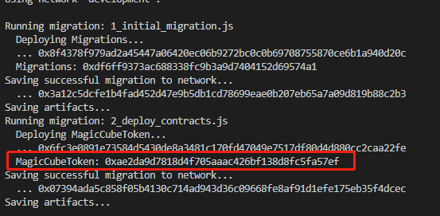

The MagicCubeToken contract is a standard ERC20 token with extra game functionality:

###  How to install dependencies 

We will use nodejs and npm help complete install dependencies.

We recommend using node 8.x.x or more, NPM 6.x.x or more

```shell
npm install
```
### development environment and dev tools
```
Ganache v1.3.0
Truffle v4.1.14 
solidity v0.4.2
web3 v0.20.0
```
### how to start Ganache

```
npm run testRPC
```


### how to compile our smart contracts
```
npm run compile
```


### how to migrate our smart contracts 
```
npm run migrate 
```



 ** In the red box, the contract address is indicated. **

### About test

we write test code by use web3.js that is v 0.20.0. Please note that do not use web3 for 1.0.0.

in the test folder , we have writed test scripts, that you can use.


# License

See the LICENSE file for details.
